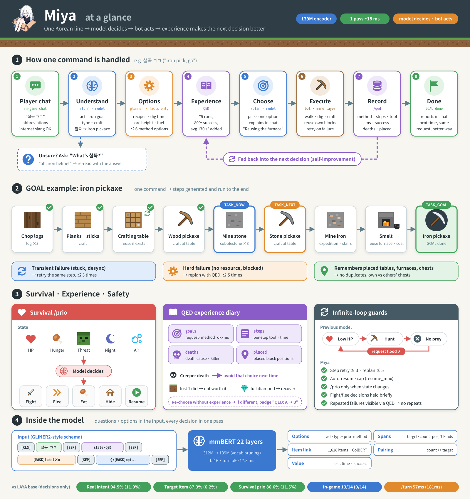

<h1 align="center">
  &nbsp;Miya
</h1>

<p align="center">Minecraft AI · a lightweight Korean-first agent where the model makes every decision</p>

<p align="center"><a href="README.md">한국어</a> | <b>English</b></p>

> [!WARNING]
> **Experimental (WIP) project.** Miya-0.2 is a research snapshot, not a finished agent.
> There is no autonomous mode yet, help-request (ask) calibration is unfinished, and some survival decisions are weak ([Limitations](#limitations)).
> Code, weights, label schema and API may change without compatibility in the next version.

> A lightweight Korean-first Minecraft agent. Every decision is made by a 139M encoder model (single forward pass, ~18 ms); the mineflayer bot only executes.

Miya takes Korean chat commands and lets the model make every decision. The bot only executes what the model can't do itself (walking, digging, clicking).
Regex or if/else logic makes no decisions. Facts such as recipes and ore heights come from a planner, and the model chooses what to do.


## Features

- **Korean slang and abbreviations**: `철곡 ㄱㄱ` (iron pickaxe, go), `철뚝 만들어` (make an iron helmet), `철셋` (iron set), `나무 5개 캐오셈` (go get 5 logs). It also recognises critique such as `그거론 한참걸리겠는데?` ("that'll take forever").
- **Asks when unsure**: when the target is uncertain, Miya asks back. It then re-reads the answer together with the original command as a multi-turn conversation.
  ```
  me: 철뚝만들어 (make 철뚝)        Miya: 철뚝이 뭔가요? (what's 철뚝?)
  me: 아아 철 헬멧 ㅇㅇ (iron helmet) Miya: 철 투구 만들게요! (making an iron helmet!)
  ```
- **GOAL-based execution**: one command is enough. Miya checks its inventory, placed blocks and surroundings, picks one of several candidate methods, runs the steps, replans on failure, and recognises when the goal is done.
- **Remembers placed blocks**: Miya reuses crafting tables and furnaces it already placed instead of crafting duplicates. It tells its own chests apart from other players' chests.
- **QED (Quasi-Evolutionary Diary)**: actions and outcomes (tool, ms, success/fail, deaths) go into a DB. The next decision gets them as experience, so methods that keep failing are avoided.
- **Survival priority**: the model weighs HP, hunger, threats, night and air, then chooses whether to fight, flee, eat, hide or resume.
- **Explains itself** in chat, e.g. "I'll reuse the furnace!" or "Using coal, 12 s faster than logs."
- **Web UI integration**: state via SSE, decision evidence (candidates, probabilities, QED) and live settings → [WEBUI_API.md](WEBUI_API.md) (Korean)

## Task types (TASK_TYPE)

Each work block gets its own type (no shared "generic" type). The model classifies an utterance into one of them and the bot runs the matching executor. Full list: [qed/task_types.sql](qed/task_types.sql)


## How a command flows

Here is what happens for "철곡 만들어" (make an iron pickaxe):




```
/turn  utterance + state → act=run goal, type=craft, target=iron_pickaxe, count=1
/plan  planner candidates: [wood→stone pickaxe] [stone pickaxe, reuse furnace] [log fuel] …
       each = step summary | est. time | risk | QED "5 runs, 80% ok, avg 170 s"
       → the model picks one (or "ask for help" if every method looks bad)
run    logs → planks → table (reuse) → wooden pick → stone → stone pick → expedition/stair-mine → iron → smelt → craft
       transient failures retry the same step (≤3); hard failures replan with fresh QED (≤5)
record /qed: method, per-step tool/ms/result/vars → injected as experience next time
survive separate loop: /prio only when state changes → fight an approaching zombie, then resume the paused goal
```

## Technology

### Model (Miya-0.2)

- **Encoder**: mmBERT, 22 layers, bf16. Fine-tuned from the encoder weights of [convaiinnovations/laya-multilingual](https://huggingface.co/convaiinnovations/laya-multilingual). All heads are new.
- **Size reduction**: vocab pruned from 256,000 to 29,252 tokens, parameters from 312M to 139M; the checkpoint is 292 MB. The original tokenizer is kept and ids are remapped inside the model.
- **GLiNER2-style schema input**: the questions and options go into the input, so **one forward pass produces every output**.
  ```
  [CLS] utterance [SEP] state·QED [SEP] ([MASK]label)×n [SEP] (question: [MASK]option…[SEP])×m
  ```

| Head | Output |
|---|---|
| option scorer | act(11) · task_type(39) · query(18) · hint(5) · prio(9) · method(via) · tidy(3) |
| span extraction | target, count, tool, person, coords, place, distance (7 labels) |
| item linking | span ↔ 1,628 items. Bi-encoder + ColBERT late interaction (partial matches like `철뚝`). NULL means ask back |
| pairing | count ↔ target (`철 3개랑 석탄 5개`, "3 iron and 5 coal") |
| value | per-method expected time and success probability |

- **Latency**: turn p50 17.8 ms / p95 19.7 ms (single GPU)

### Planner (facts) vs model (choice)

- `model/planner.py` builds up to 6 candidate methods from the recipe tree, mining time per tool tier, ore generation heights and fuel efficiency. Each candidate has a step list, estimated time and risk.
- The model decides which candidate to use. Training data simulates **hidden true outcomes** that differ from the estimate (resource missing, slow, stuck). This teaches the model to trust the QED experience text over the planner's estimate.

### QED — self-improvement from experience

- **Records**: goals (request, method, result, ms, variables), steps, deaths (cause, killer, gear, inventory value) and placed blocks.
- **Injection**: the last 20 runs of the same goal and method path are summarised and appended to the option text. **No rule decides; the model reads the text.**
- **Attribution**: the model chooses once more without experience. If the pick differs, the decision is flagged `changed` (web UI badge "QED: A → B").
- Death causes feed the survival context. Item value (base value plus acquisition difficulty) drives decisions about recovering items after death.
- Schema: [qed/schema.sql](qed/schema.sql)


The web UI's decision panel in a real run. For `철곡 만들어` (make an iron pickaxe) each of the 7 planner options carries choice probability, estimate, predicted time, risk and QED experience (14 runs, 29% success, recent death); the model picked reusing the already placed crafting table and furnace at 83%.

### Loop protection

The previous model could loop forever: "low HP → hunt → no animals → low HP", flooding the server with requests. Miya prevents this with:

- Caps: step retries ≤3, replans ≤5, auto-resume limit (`resume_max`).
- The survival check fires only when the state signature changes, and a fight/flee decision is held for `prio_hold_ms`.
- Recent consecutive failures show up in the options, so the model stops repeating the same method.

## Benchmark (Miya-0.2 vs LAYA base, zero-shot)

Planner, QED and bot are identical; only the decision model is swapped. Details: [bench/RESULT.md](bench/RESULT.md) (Korean)

| Metric | Miya-0.2 | LAYA base |
|---|---|---|
| real-utterance intent (act) | **94.5%** | 11.0% |
| task type | **89.7%** | 40.5% |
| target item | **87.3%** | 6.2% |
| method choice (plan) | **73.6%** | 27.4% |
| survival priority (prio) | **86.6%** | 11.5% |
| /turn p50 | **57 ms** | 181 ms |
| in-game, 14 scenarios | **13/14** | 0/14 |

## Examples (real serving output)

Real responses from `model/serve.py` (:8765). Probabilities and ms rounded, some fields omitted.

```bash
S='"state":{"hp":20,"food":20,"night":false,"inv":{"oak_log":4},"task":null}'
curl -s localhost:8765/turn -d "{\"utt\":\"철곡 만들어\",$S}"
```

| utterance | act | type | target · count | hint | ms |
|---|---|---|---|---|---|
| `철곡 만들어` (make iron pick) | run goal 1.00 | craft | `철곡` → iron_pickaxe (철 곡괭이) | short | 25 |
| `나무 5개 캐오셈` (go get 5 logs) | run goal 1.00 | log | `나무` → grp:log · `5개` → 5 | short | 21 |
| `철뚝 ㄱㄱ` (iron helmet, go) | run goal 1.00 | craft | `철뚝` → iron_helmet (철 투구) | slow | 22 |
| `그거론 한참걸리겠는데?` ("that'll take forever") | criticism/advice 1.00 | — | — | slow | 25 |

```bash
curl -s localhost:8765/plan -d '{"goal":"iron_pickaxe","cnt":1,"inv":{"oak_log":4},"placed":{},"near":{},"hp":20,"night":false,"armor":0}'
```
```json
{"detail": {"pick_ko": "나무 곡괭이 경유, 돌 곡괭이 경유", "qed_changed": false,
  "opts": [{"ko": "나무 곡괭이 경유, 돌 곡괭이 경유", "p": 0.58, "est_s": 321, "risk": 15,
             "qed": {"n": 20, "ok": 0.6, "avg_ms": 273603},
             "steps": ["제작 참나무 판자 12", "제작 제작대 1", "설치 제작대 1", "제작 막대기 4", "제작 나무 곡괭이 1",
                       "원정 돌 1", "채광 돌 11(나무 곡괭이)", "…", "화로 철 주괴 3", "제작 철 곡괭이 1"]},
           {"ko": "나무 곡괭이 경유, 돌 곡괭이 경유, 연료 석탄", "p": 0.25, "est_s": 446, "risk": 25}, …]}}
```

```bash
curl -s localhost:8765/prio -d '{"ctx":"체력 5/20 배고픔 18/20 | 밤 | 위협: 좀비 4칸"}'
# {"label":"달려서 도망","p":0.48,"ms":20.5}
```

## Running

Requirements:

- Python 3.12 and a CUDA GPU
- Node 24+
- Paper or vanilla server 26.1.2 in offline mode (or Microsoft login → below)

```bash
# 1. Python
python -m venv .venv && .venv/bin/pip install -r requirements.txt

# 2. Weights (Hugging Face)
hf download snowman6/Miya-0.2 --local-dir ckpt/miya-0.2

# 3. Bot
cd bot && npm install && cd ..

# 4. Game data (not included; extract locally from the official jars) → docs/extract.en.md

# 5. Server + bot (logs: /tmp/cw/{serve,bot}.log, auto-reconnect)
./run.sh localhost:25565     # server address. Online server: MC_AUTH=microsoft ./run.sh host:port
```

### Server and login

The server the bot joins must be one of:

- **Offline-mode server** (`online-mode=false` in `server.properties`): the default (`MC_AUTH=offline`), any name works
- **Online (premium) server**: `MC_AUTH=microsoft` (or `--auth microsoft`). On first run `bot.log` prints `[MS 로그인] https://microsoft.com/link 에서 코드 XXXX 입력` (open the link, enter the code) — sign in with a Microsoft account for the bot. The token is cached in `bot/.auth/` (gitignored), later runs log in automatically. Set `NAME` to the account email; the in-game name comes from the account profile

| setting (env / bot flag) | default | purpose |
|---|---|---|
| `MC_HOST`:`MC_PORT` / `--server host:port` | localhost:25565 | server to join (`./run.sh host:port` also works) |
| `NAME` / `--name` | Miya | bot name |
| `MC_AUTH` / `--auth` | offline | `offline` · `microsoft` |
| `MC_VERSION` / `--version` | 26.1.2 | `auto` = detect server version (untested) |
| `API` / `--api` | http://127.0.0.1:8765 | model server. If remote, run.sh does not start a local one |
| `SERVE_HOST` | 127.0.0.1 | model server bind. Use `0.0.0.0` for bots on other machines |

`cp .env.example .env` to keep your settings. Precedence: flags > env > `.env`.

Chat in game with no prefix, e.g. `철곡 만들어` (make an iron pickaxe), `나무 5개 캐와` (get 5 logs), `체력 어때` (how's your HP), `멈춰` (stop), `계속해` (continue). The bot name comes from `NAME` (default Miya).

- Bot settings: `bot/settings.json` or `POST :8090/settings` (23 fields, e.g. threat radius, mining mode, hostile policy)
- Web viewer textures: optional step in [docs/extract.en.md](docs/extract.en.md)

## Training

```bash
.venv/bin/python data/gen.py          # synthetic data → data/gen/{train,dev}.jsonl
.venv/bin/python model/train.py       # → ckpt/miya-0.2 (EP, BS, LR via env)
.venv/bin/python model/eval.py        # real utterances, holdout, dev, latency
```

The development loop:

1. Generate synthetic data: labels come from the planner, states are randomised, and slang is mixed in.
2. Train and evaluate.
3. Test in-game.
4. Log the problems in [Claude_DEVLOG.md](Claude_DEVLOG.md) (Korean).
5. Build the next round of data from those problems.

Both training and serving need `mcdata/mc.db` and `data/mcx.db` → [docs/extract.en.md](docs/extract.en.md)

## Limitations

- **No autonomous mode**: "자급자족해" (be self-sufficient) is classified but not executed.
- **Ask over-calibration**: over-asks for help when experience shows a middling success rate.
- **Survival weak spots**: low accuracy on flee-by-pillaring and dig-in-and-hide; the fight/flee boundary is fuzzy.
- **Data bias**: mostly synthetic training data, little real chat. Korean only.
- **Fixed environment**: Minecraft 26.1.2; tasks mineflayer can't do (enchanting, trading, ranged) are not executed yet.

## Roadmap

- Autonomous mode: survive and progress on its own (farming, gear upgrades, housing, chest sorting), with QED as the reward loop.
- Calibrate "ask for help": the model currently over-asks when experience shows a middling success rate.
- Port the serving and bot to Rust.

## Versions

[VERSION_NOTES.md](VERSION_NOTES.md) · dev log [Claude_DEVLOG.md](Claude_DEVLOG.md) (Korean)

## License

Apache-2.0 ([LICENSE](LICENSE), [NOTICE](NOTICE)) + [Miya Adopt Licence](LICENSE-MIYA.md) (non-binding requests).
Model weights derive from laya-multilingual (Apache-2.0; its encoder is mmBERT-base, MIT).
Minecraft is a trademark of Mojang Studios; this project is not affiliated with it. No game data or assets are included.
