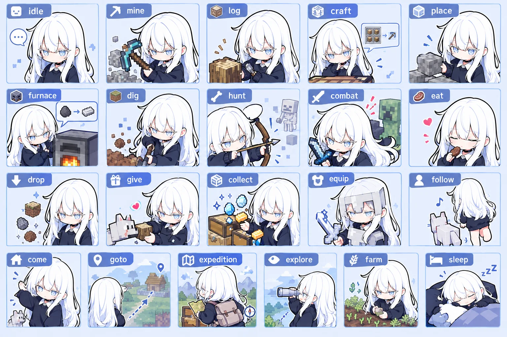
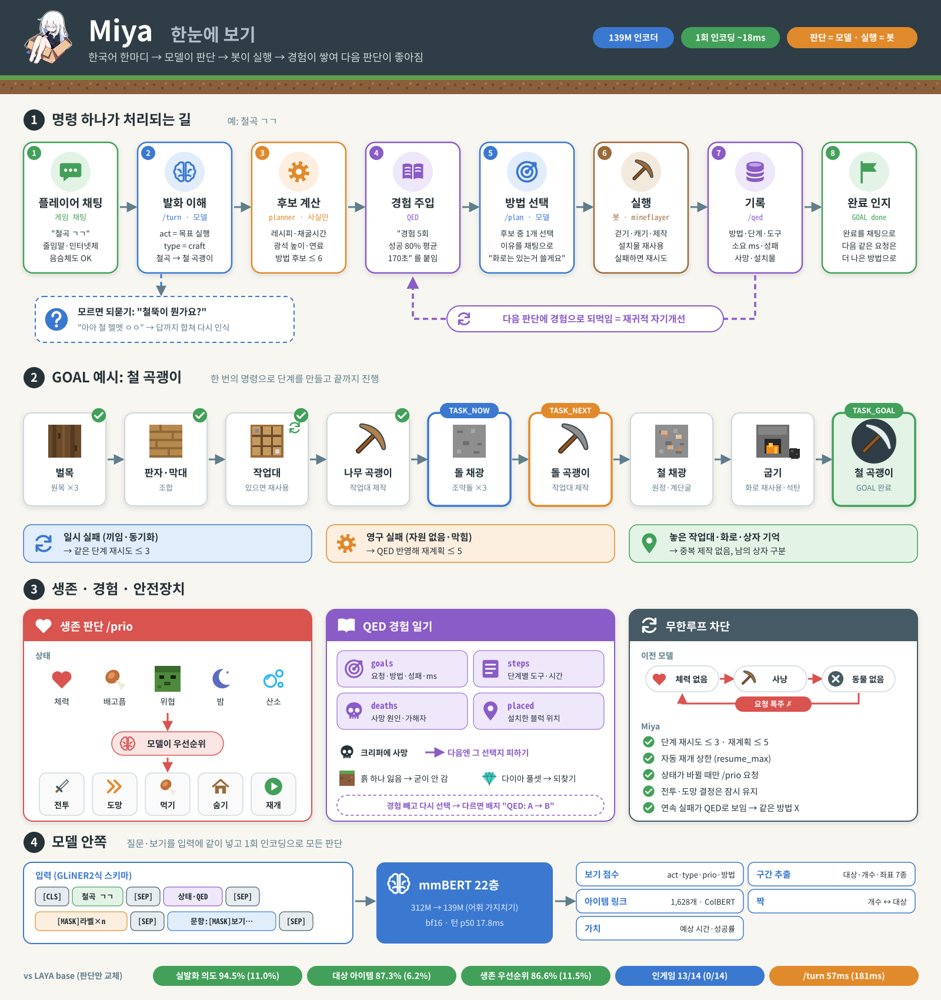
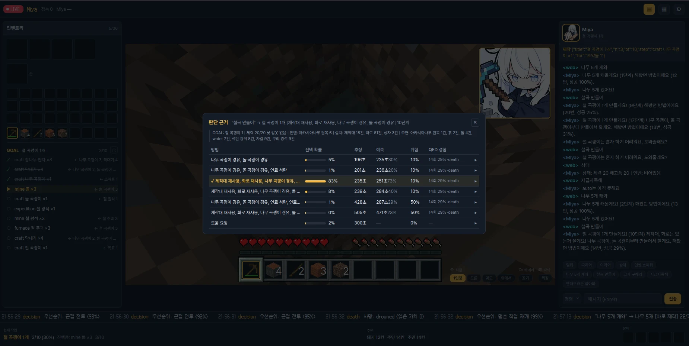

<h1 align="center">
  &nbsp;Miya
</h1>

<p align="center">마인크래프트 AI · 한국어 명령을 모델이 판단하는 가벼운 에이전트</p>

<p align="center"><b>한국어</b> | <a href="README.en.md">English</a></p>

> [!WARNING]
> **실험적(WIP) 프로젝트입니다.** Miya-0.2는 연구용 스냅샷이며 완성된 에이전트가 아닙니다.
> 자율모드는 아직 없고, 도움 요청(ask) 보정이 덜 됐으며, 생존 판단 일부가 약합니다([한계](#한계)).
> 코드·가중치·라벨 스키마·API는 다음 버전에서 호환 없이 바뀔 수 있습니다.

> A lightweight Korean-first Minecraft agent. Every decision is made by a 139M encoder model (single forward pass, ~18 ms); the mineflayer bot only executes.

Miya는 한국어 명령을 받아 판단은 모두 모델이 하는 마인크래프트 AI입니다. 봇은 모델이 직접 할 수 없는 실행(걷기·캐기·클릭)만 맡습니다.
정규식이나 조건문으로 판단하지 않습니다. 레시피나 광석 높이 같은 사실은 planner가 계산하고, 무엇을 할지는 모델이 고릅니다.


## 특징

- **한국어 줄임말·인터넷체 인식**: `철곡 ㄱㄱ`, `철뚝 만들어`(철 투구), `철셋`(철 세트), `나무 5개 캐오셈`, `그거론 한참걸리겠는데?`(지적·조언)
- **모르면 되묻기**: 대상이 불확실하면 되묻고, 답변까지 합쳐 멀티턴으로 다시 인식
  ```
  나: 철뚝만들어      Miya: 철뚝이 뭔가요?
  나: 아아 철 헬멧 ㅇㅇ  Miya: 철 투구 만들게요!
  ```
- **GOAL 방식 진행**: 한 번의 명령으로 인벤·설치물·주변을 확인하고, 방법 후보 중 하나를 고른 뒤 단계를 실행합니다. 실패하면 다시 계획하고, 끝나면 완료를 인지합니다.
- **설치물 기억**: 이미 놓은 작업대·화로는 다시 쓰고 중복 제작하지 않습니다. 내 상자와 남의 상자를 구분합니다.
- **QED (Quasi-Evolutionary Diary)**: 행동과 결과(도구, 소요 ms, 성공·실패, 사망)를 DB에 쌓아 다음 판단에 경험으로 넣습니다. 반복해서 실패한 방법은 피합니다.
- **생존 판단**: 체력·배고픔·위협·밤·산소를 보고 전투, 도망, 먹기, 숨기, 재개 중 무엇을 먼저 할지 모델이 판단합니다.
- **이유 설명**: 채팅으로 이유를 말합니다. 예: "화로는 있는거 쓸게요!", "연료는 석탄 쓸게요, 원목보다 12초 빨라요."
- **WEBUI 연동**: 상태 SSE, 판단 근거(후보·확률·QED), 설정 변경 → [WEBUI_API.md](WEBUI_API.md)

## 작업 종류 (TASK_TYPE)

작업 블럭별로 개별 타입을 부여합니다(공통 없음). 모델이 발화를 이 중 하나로 분류하고, 봇이 해당 실행기를 돌립니다. 전체 목록: [qed/task_types.sql](qed/task_types.sql)



## 동작 흐름

"철곡 만들어"를 받았을 때의 흐름입니다.




```
/turn  발화 + 상태 → act=목표 실행, type=craft, 대상=iron_pickaxe(철곡), 개수=1
/plan  planner 후보: [나무곡→돌곡 경유] [돌곡 경유, 화로 재사용] [연료 원목] …
       각 후보 = 단계 요약 | 예상 시간 | 위험 | QED 경험 "경험 5회 성공 80% 평균 170초"
       → 모델이 선택 (모든 방법이 나쁘면 "도움 요청")
실행   벌목 → 판자 → 작업대(재사용) → 나무곡 → 돌 채광 → 돌곡 → 원정·계단굴 → 철 채광 → 굽기 → 철곡 제작
       일시 실패(끼임·동기화)는 같은 단계 재시도(≤3), 영구 실패는 재계획(QED 최근 실패 반영, ≤5)
기록   /qed: 방법·단계별 도구·ms·성패·변수 → 다음 같은 GOAL의 보기 텍스트에 경험으로 주입
생존   별도 루프: 상태가 바뀔 때만 /prio → 좀비 접근 시 전투, 끝나면 멈춘 작업 재개
```

## 기술

### 모델 (Miya-0.2)

- **인코더**: mmBERT 22층, bf16. [convaiinnovations/laya-multilingual](https://huggingface.co/convaiinnovations/laya-multilingual)의 인코더 가중치에서 파인튜닝했고, 헤드는 모두 새로 만들었습니다.
- **경량화**: 어휘 가지치기로 256,000→29,252, 파라미터 312M→139M, ckpt 292MB가 되었습니다. 토크나이저는 원본을 그대로 쓰고 모델 안에서 id를 변환합니다.
- **GLiNER2식 스키마 입력**: 질문·보기를 입력에 함께 넣어 **1회 인코딩으로 모든 출력**을 냅니다.
  ```
  [CLS] 발화 [SEP] 상태·QED [SEP] ([MASK]라벨)×n [SEP] (문항: [MASK]보기…[SEP])×m
  ```

| 헤드 | 출력 |
|---|---|
| 보기 점수 | act(11) · task_type(39) · query(18) · hint(5) · prio(9) · 방법(via) · 정리(3) |
| 구간 추출 | 대상·개수·도구·사람·좌표·장소·거리 7종 |
| 아이템 링크 | 구간 ↔ 아이템 1,628개. bi-encoder + ColBERT late interaction(`철뚝` 같은 부분일치). NULL이면 되묻기 |
| 짝 | 개수 ↔ 대상 연결 (`철 3개랑 석탄 5개`) |
| 가치 | 방법별 예상 소요시간·성공확률 |

- **지연**: 턴 p50 17.8ms / p95 19.7ms (단일 GPU)

### planner (사실) vs 모델 (선택)

- `model/planner.py`는 레시피 트리, 채굴 시간(도구 티어), 광석 생성 높이, 연료 효율로 방법 후보를 최대 6개 만듭니다. 각 후보는 단계열·예상 시간·위험입니다.
- 어느 후보를 고를지는 모델이 정합니다. 학습데이터에서는 추정치와 다른 **숨은 참값**(자원 없음, 느림, 막힘)을 시뮬레이션합니다. 그래서 모델은 QED 경험 텍스트를 읽고 추정치보다 경험을 믿는 법을 배웁니다.

### QED — 경험 기반 자기개선

- 기록: GOAL(요청·방법·성패·ms·변수), 단계, 사망(원인·가해자·장비·인벤 가치), 설치물을 남깁니다.
- 주입: 같은 GOAL·같은 방법 경로의 최근 20건을 요약해 보기 텍스트에 붙입니다. **규칙이 아니라 모델이 읽고** 판단합니다.
- 발현 표기: 경험을 빼고 한 번 더 선택해 봅니다. 결과가 다르면 `changed`로 표시합니다(WEBUI 배지 "QED: A → B").
- 사망 원인은 생존 판단 ctx에 들어가고, 아이템 가치(기본 + 획득 난이도)는 회수 판단에 쓰입니다.
- 스키마: [qed/schema.sql](qed/schema.sql)



실제 WEBUI 판단 근거 화면. `철곡 만들어` → planner 후보 7개마다 선택 확률·추정·예측 시간·위험·QED 경험(14회, 성공 29%, 최근 사망)이 붙고, 모델이 이미 놓은 작업대·화로를 재사용하는 방법을 83%로 골랐습니다.

### 무한루프 차단

이전 모델에서는 "체력 없음 → 사냥 → 동물 없음 → 체력 없음"을 반복하며 요청이 폭주했습니다. 이를 막기 위해 다음을 넣었습니다.

- 단계 재시도 ≤3, 재계획 ≤5, 자동 재개 상한(`resume_max`)
- 생존 판단은 상태 시그니처가 바뀔 때만 요청하고, 전투·도망 결정은 일정 시간 유지(`prio_hold_ms`)
- QED 최근 연속 실패가 보기에 드러나므로 같은 방법을 반복하지 않음

## 벤치마크 (Miya-0.2 vs LAYA base 제로샷)

planner·QED·봇은 같고 판단만 바꿨습니다. 상세: [bench/RESULT.md](bench/RESULT.md)

| 항목 | Miya-0.2 | LAYA base |
|---|---|---|
| 실발화 의도(act) | **94.5%** | 11.0% |
| 작업 종류(type) | **89.7%** | 40.5% |
| 대상 아이템(tgt) | **87.3%** | 6.2% |
| 방법 선택(plan) | **73.6%** | 27.4% |
| 생존 우선순위(prio) | **86.6%** | 11.5% |
| /turn p50 | **57ms** | 181ms |
| 인게임 14 시나리오 | **13/14** | 0/14 |

## 실행

요구사항:

- Python 3.12, CUDA GPU
- Node 24+
- Paper/바닐라 서버 26.1.2 (오프라인 모드, 또는 MS 계정 로그인 → 아래)

```bash
# 1. 파이썬
python -m venv .venv && .venv/bin/pip install -r requirements.txt

# 2. 가중치 (HF)
hf download snowman6/Miya-0.2 --local-dir ckpt/miya-0.2

# 3. 봇
cd bot && npm install && cd ..

# 4. 게임 데이터 (미포함, 공식 jar에서 로컬 추출) → docs/extract.md

# 5. 서빙 + 봇 (로그: /tmp/cw/{serve,bot}.log, 봇 끊기면 자동 재접속)
./run.sh localhost:25565     # 서버 주소. 정품 서버면 MC_AUTH=microsoft ./run.sh host:port
```

### 서버 접속 · 로그인

봇이 붙을 서버는 둘 중 하나여야 합니다.

- **오프라인 모드 서버** (`server.properties` 의 `online-mode=false`): 기본값(`MC_AUTH=offline`), 아무 이름으로 접속
- **정품 서버**: `MC_AUTH=microsoft` (또는 `--auth microsoft`). 첫 실행시 `bot.log` 에 `[MS 로그인] https://microsoft.com/link 에서 코드 XXXX 입력` 이 뜨면 봇 전용 MS 계정으로 로그인. 토큰은 `bot/.auth/` 에 캐시(gitignore)되어 다음부터 자동. `NAME` 은 계정 이메일, 게임 닉은 계정 프로필을 따름

| 설정 (env / 봇 인자) | 기본 | 용도 |
|---|---|---|
| `MC_HOST`:`MC_PORT` / `--server host:port` | localhost:25565 | 접속할 서버 (`./run.sh host:port` 도 가능) |
| `NAME` / `--name` | Miya | 봇 이름 |
| `MC_AUTH` / `--auth` | offline | `offline` · `microsoft` |
| `MC_VERSION` / `--version` | 26.1.2 | `auto` = 서버 버전 자동 (미검증) |
| `API` / `--api` | http://127.0.0.1:8765 | 서빙 주소. 원격이면 run.sh 가 로컬 서빙을 안 띄움 |
| `SERVE_HOST` | 127.0.0.1 | 서빙 바인드. 다른 PC 봇이 붙으려면 `0.0.0.0` |

`cp .env.example .env` 로 고정해 두면 편합니다. 우선순위: 인자 > env > `.env`.

게임 채팅 예: `철곡 만들어`, `나무 5개 캐와`, `체력 어때`, `멈춰`, `계속해`. 접두어 없이 쓰면 되고, 봇 이름은 `NAME`(기본 Miya)입니다.

- 봇 설정: `bot/settings.json` 또는 `POST :8090/settings` (위협 반경, 채광 방식, 적대몹 대응 등 23개)
- 웹 뷰어 텍스처: [docs/extract.md](docs/extract.md) 선택 항목

## 학습

```bash
.venv/bin/python data/gen.py          # 합성 데이터 → data/gen/{train,dev}.jsonl
.venv/bin/python model/train.py       # → ckpt/miya-0.2 (EP·BS·LR env)
.venv/bin/python model/eval.py        # 실발화·holdout·dev·지연
```

1. 합성 데이터를 만듭니다. planner로 정답을 만들고, 상태를 무작위화하고, 줄임말과 인터넷말을 섞습니다.
2. 학습·평가합니다.
3. 인게임에서 실측합니다.
4. 문제를 [Claude_DEVLOG.md](Claude_DEVLOG.md)에 기록합니다.
5. 그 기록으로 다음 데이터를 만들고 1로 돌아갑니다.

학습과 서빙 모두 `mcdata/mc.db`, `data/mcx.db`가 필요합니다 → [docs/extract.md](docs/extract.md)

## 한계

- **자율모드 없음**: "자급자족해"는 분류만 되고 실행되지 않습니다.
- **ask 과보정**: 성공률이 중간인 경험에서 도움 요청을 과하게 고릅니다.
- **생존 판단 약점**: 블럭 쌓아 도망·굴 파고 숨기 정답률이 낮고, 전투/도망 경계가 애매합니다.
- **데이터 편향**: 학습 데이터 대부분이 합성이고 실발화는 소량입니다. 한국어 전용입니다.
- **환경 고정**: Minecraft 26.1.2 기준, mineflayer로 불가능한 작업(인챈트·거래·원거리)은 아직 실행하지 않습니다.

## 로드맵

- 자율모드: 생존·발전(농사, 장비 업그레이드, 집, 상자 정리)을 스스로 진행하고, QED를 보상으로 쓰는 루프
- 도움 요청(ask) 보정: 중간 성공률 경험에서 과하게 도움을 요청하는 문제
- Rust 서빙·봇 포팅

## 버전

[VERSION_NOTES.md](VERSION_NOTES.md) · 개발 로그 [Claude_DEVLOG.md](Claude_DEVLOG.md)

## 라이선스

Apache-2.0 ([LICENSE](LICENSE), [NOTICE](NOTICE)) + [Miya Adopt Licence](LICENSE-MIYA.md) (부탁 조항).
모델 가중치는 laya-multilingual(Apache-2.0, 인코더 mmBERT-base MIT)에서 파생했습니다.
Minecraft는 Mojang Studios의 상표이며 본 프로젝트와 무관합니다. 게임 데이터·에셋은 포함하지 않습니다.
