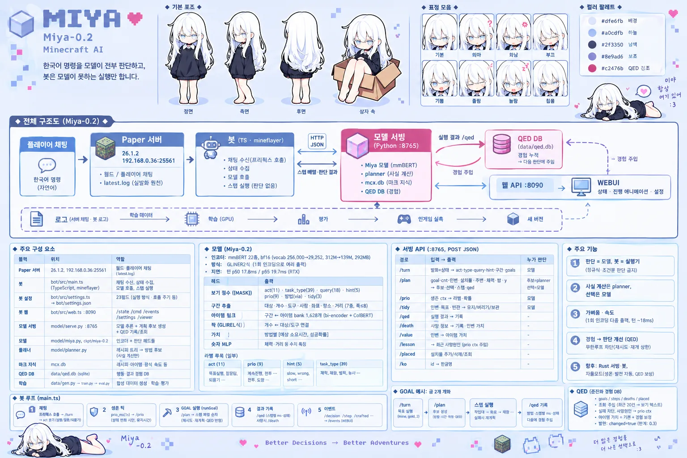
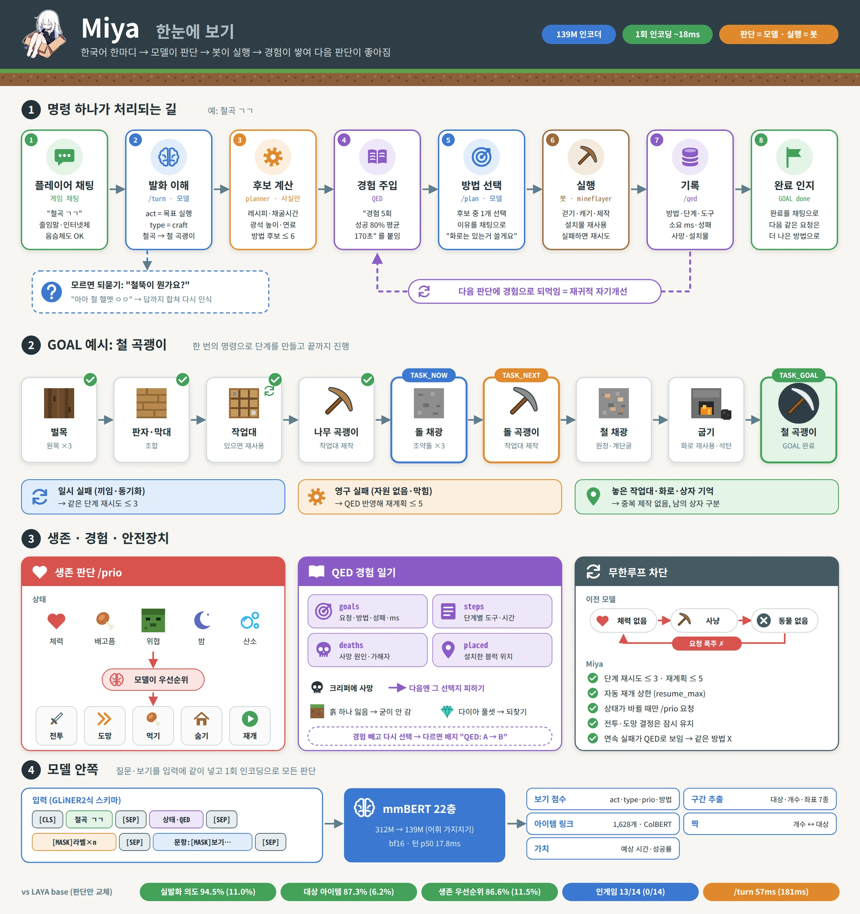
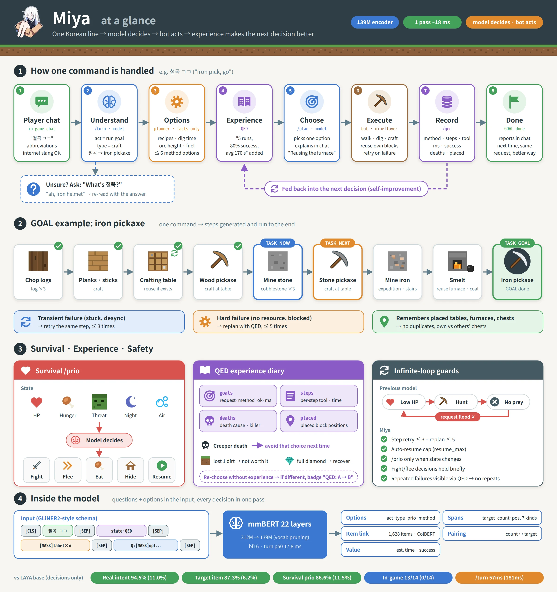

<h1 align="center">
  &nbsp;Miya-0.2
</h1>

<p align="center">한국어 마인크래프트 AI 판단 모델 · 139M 인코더 · 1회 인코딩 ~18ms<br><a href="https://github.com/snowman6-git/Miya">GitHub: 봇 · 서빙 · 학습 코드</a> · <a href="https://huggingface.co/snowman6/Miya-0.2/blob/main/README.en.md">English</a></p>

> [!WARNING]
> **개발 중(WIP) 모델입니다.** 0.2는 연구용 스냅샷이며 완성된 에이전트가 아닙니다.
> 자율모드는 아직 없고, 도움 요청(ask) 보정이 덜 됐으며, 생존 판단 일부가 약합니다([한계](#한계--미완성)).
> 가중치·라벨 스키마·API는 다음 버전에서 호환 없이 바뀔 수 있습니다.
>
> **Work in progress.** A research snapshot, not a finished agent. Weights, label schema and API may change without notice.

Korean-first Minecraft agent decision model. One encoder pass (~18 ms) gives intent, task type, target item and count spans, method choice, survival priority and inventory tidy decisions. The mineflayer bot only executes. Full English card: [README.en.md](https://huggingface.co/snowman6/Miya-0.2/blob/main/README.en.md).



## 한눈에 보기



<details><summary>English version</summary>



</details>

## 무엇을 하나

Miya는 "모든 판단은 모델이 하고, 봇은 실행만 한다"는 원칙으로 만들고 있는 마인크래프트 AI의 **판단 모델**입니다.
정규식이나 조건문으로 판단하지 않습니다. 레시피나 광석 높이 같은 사실은 planner가 계산하고, 무엇을 할지는 모델이 고릅니다.

- **한국어 구어체 인식**: `철곡 ㄱㄱ`(철 곡괭이), `철뚝`(철 투구), `철셋`(철 세트), 음슴체, 인터넷체
- **지적·조언 분류**: `그거론 한참걸리겠는데?`, `그거 맞아?`
- **모르면 되묻기**: 아이템 링크가 NULL이면 되묻고, 답까지 합쳐 다시 인식합니다(멀티턴)
- **방법 선택**: planner가 만든 후보 중 QED 경험을 보고 하나를 고릅니다
- **생존 우선순위**: 체력·배고픔·위협·밤·산소를 보고 전투·도망·먹기·숨기·재개 중 하나를 고릅니다

## 구조

### 전체 시스템

```
플레이어 채팅 ─▶ Paper 서버 ─▶ 봇(TS·mineflayer) ─HTTP JSON─▶ 서빙(Python stdlib, :8765)
                                   │                            ├─ Miya 모델 (이 저장소, 판단)
                                   │                            ├─ planner   (사실: 레시피·채굴시간·방법 후보)
                                   │                            ├─ mcx.db    (마크 지식: 광석 높이·스폰·가치)
                                   └─ 실행 결과 /qed ──────────▶└─ QED DB    (경험)
```

| 구성요소 | 하는 일 | 하지 않는 일 |
|---|---|---|
| **Miya 모델** | 발화 이해, 방법 선택, 생존 우선순위, 인벤 정리 | 길찾기, 블럭 조작 |
| **planner** | 목표 + 상태 → 방법 후보(최대 6개)와 단계열·예상 시간·위험 | 후보 중 선택 |
| **QED DB** | 행동과 결과 기록, 다음 판단에 경험 텍스트로 주입 | 규칙으로 차단 |
| **봇** | 걷기·캐기·제작·전투 실행, 결과 보고 | 판단 |

### 모델

**인코더.** mmBERT 22층, bf16.

- [laya-multilingual](https://huggingface.co/convaiinnovations/laya-multilingual)의 인코더 가중치에서 파인튜닝했고, 헤드는 모두 새로 만들었습니다.
- 어휘를 가지치기해서 256,000 → 29,252, 파라미터를 312M → 139M으로 줄였습니다.
- 토크나이저는 원본을 그대로 쓰고, 모델 안의 remap 버퍼가 id를 바꿉니다.

**입력.** GLiNER2식 스키마 입력입니다. 질문과 보기를 입력 안에 함께 넣어 **한 번 인코딩으로 모든 출력**을 냅니다.

```
[CLS] 발화 [SEP] 상태·QED [SEP] ([MASK]라벨)×n [SEP] (문항: [MASK]보기…[SEP])×m
```

각 `[MASK]` 위치의 벡터가 그 보기의 점수가 되고, 문항별로 softmax를 취합니다.
보기가 입력 텍스트이기 때문에 planner 후보나 QED 경험 문장이 바뀌어도 헤드를 다시 만들 필요가 없습니다.

**헤드.**

| 헤드 | 출력 |
|---|---|
| 보기 점수 | act(11) · task_type(39) · query(18) · hint(5) · prio(9) · 방법(via) · tidy(3) |
| 구간 추출 | 대상 · 개수 · 도구 · 사람 · 좌표 · 장소 · 거리 (7종, 폭 ≤ 8) |
| 아이템 링크 | 구간 ↔ 이름 bank 1,628개 (아이템 + 몹 + 그룹·세트·장소). bi-encoder + ColBERT late interaction으로 `철뚝` 같은 부분일치 처리. NULL이면 되묻기 |
| 짝 | 개수 ↔ 대상·도구 연결 (`철 3개랑 석탄 5개`) |
| 가치 | 방법별 log 소요시간 · 성공확률 |

**라벨.** 문항별 라벨은 `schema.json`에 있습니다.

| 문항 | 라벨 |
|---|---|
| act (11) | 목표 실행, 질문 답하기, 되묻기, 멈춤, 재개, 긍정 대답, 부정 대답, 잡담, 욕설, 위험 경고, 지적·조언 |
| prio (9) | 계속 진행, 근접 전투, 달려서 도망, 블럭 쌓아 도망, 굴 파고 숨기, 먹기, 멈춘 작업 재개, 물 위로 올라가기, 인벤 정리 |
| hint (5) | slow, wrong, short, danger, done_claim |
| tidy (3) | 유지, 버리기, 상자에 보관 |

### 작업 종류 (TASK_TYPE)

작업 블럭마다 개별 타입을 부여합니다(공통 타입 없음). 모델이 발화를 이 중 하나로 분류하면 봇이 해당 실행기를 돌립니다.


### planner (사실) vs 모델 (선택)

planner는 다음 사실로 방법 후보를 만듭니다.

- 레시피 트리
- 채굴 시간(도구 티어별)
- 광석 생성 높이
- 연료 효율
- 이미 놓은 작업대·화로

예를 들어 "철곡 만들어"에는 `[나무곡→돌곡 경유]`, `[돌곡 경유, 화로 재사용]`, `[연료 원목]` 같은 후보가 나옵니다.

학습 데이터에서는 추정치와 다른 **숨은 참값**(자원 없음, 느림, 막힘)을 시뮬레이션합니다. 그래서 모델은 추정치만 믿지 않고, 함께 주어진 QED 경험 텍스트를 읽고 판단하는 법을 배웁니다.

## QED — Quasi-Evolutionary Diary

행동과 결과를 DB에 쌓아 다음 판단에 **경험 텍스트로 넣습니다**. 규칙으로 막지 않고 모델이 읽고 판단합니다.

**기록.** 봇은 GOAL이 끝날 때마다 `/qed`로 결과를 보냅니다.

| 표 | 내용 |
|---|---|
| `goals` | 요청, 목표, 개수, 방법(via), 성공, 소요 ms, 실패 사유, 변수(보유 도구·장비·시간) |
| `steps` | 단계별 type · target · cnt · 도구 · ms · 성공 · 실패 사유 |
| `deaths` | 사망 원인, 가해자, 체력·배고픔·밤·방어·무기, 위치, 인벤과 그 가치, 진행 중이던 GOAL |
| `placed` | 봇이 설치한 블럭 (작업대·화로·상자 재사용, 남의 상자와 구분) |

**주입.** 같은 goal에서 방법 경로가 같은 최근 20건을 요약해 보기 텍스트 뒤에 붙입니다.

```
direct | 원정 참나무 원목 1 → 벌목 참나무 원목 2 → 제작 참나무 판자 8 → … | 예상 301초 위험 40% | 경험 5회 성공 80% 평균 170초 최근실패 1회(no_ore)
```


실제 WEBUI 판단 근거 화면. `철곡 만들어` → planner 후보 7개마다 선택 확률·추정·예측 시간·위험·QED 경험(14회, 성공 29%, 최근 사망)이 붙고, 모델이 이미 놓은 작업대·화로를 재사용하는 방법을 83%로 골랐습니다.

**발현 표기.** 경험을 뺀 상태로 한 번 더 선택해 봅니다. 결과가 다르면 `changed`로 표시합니다(경험이 판단을 바꿨다는 뜻).

**사망·가치.** 최근 사망 원인은 생존 판단 ctx에 들어갑니다. 아이템 가치(기본값 + 획득 난이도)는 회수 판단에 씁니다. 예를 들어 흙 하나를 잃었으면 굳이 가지 않고, 다이아 풀셋이면 되찾으러 갑니다.

**무한루프 차단.** 이전 모델은 "체력 없음 → 사냥 → 동물 없음 → 체력 없음"을 반복하며 요청이 폭주했습니다. 지금은 다음 장치로 막습니다.

- 단계 재시도 ≤ 3, 재계획 ≤ 5
- 생존 판단은 상태가 바뀔 때만 요청
- 연속 실패가 QED로 드러나 같은 방법을 반복하지 않음

## 평가

LAYA base와 비교했습니다. planner·QED·봇은 같게 두고 **판단만 교체**했습니다.

- 실발화: 서버 채팅 원문 488건, 학습에서 제외
- dev: 5.8k
- 인게임: 같은 시드의 로컬 서버 2대에서 14개 시나리오를 병렬로 실행

| | Miya-0.2 | LAYA base (zero-shot) |
|---|---|---|
| 실발화 의도 (act) | **94.5%** | 11.0% |
| 작업 종류 (type) | **89.7%** | 40.5% |
| 대상 아이템 (target) | **87.3%** | 6.2% |
| 방법 선택 (plan) | **73.6%** | 27.4% |
| 생존 우선순위 (prio) | **86.6%** | 11.5% |
| 인게임 14 시나리오 | **13/14** | 0/14 |
| 모델 지연 p50 / p95 | 17.8 / 19.7 ms | — |

## 예시 (실제 서빙 출력)

`model/serve.py`(:8765)에 요청한 실제 응답입니다. 확률·ms 는 반올림, 출력 일부 생략.

```bash
S='"state":{"hp":20,"food":20,"night":false,"inv":{"oak_log":4},"task":null}'
curl -s localhost:8765/turn -d "{\"utt\":\"철곡 만들어\",$S}"
```

| 발화 | act | type | 대상 · 개수 | hint | ms |
|---|---|---|---|---|---|
| `철곡 만들어` | 목표 실행 1.00 | craft | `철곡` → iron_pickaxe (철 곡괭이) | short | 25 |
| `나무 5개 캐오셈` | 목표 실행 1.00 | log | `나무` → grp:log · `5개` → 5 | short | 21 |
| `철뚝 ㄱㄱ` | 목표 실행 1.00 | craft | `철뚝` → iron_helmet (철 투구) | slow | 22 |
| `그거론 한참걸리겠는데?` | 지적·조언 1.00 | — | — | slow | 25 |

```bash
curl -s localhost:8765/plan -d '{"goal":"iron_pickaxe","cnt":1,"inv":{"oak_log":4},"placed":{},"near":{},"hp":20,"night":false,"armor":0}'
```
```json
{"detail": {"pick_ko": "나무 곡괭이 경유, 돌 곡괭이 경유", "qed_changed": false,
  "opts": [{"ko": "나무 곡괭이 경유, 돌 곡괭이 경유", "p": 0.58, "est_s": 321, "risk": 15,
             "qed": {"n": 20, "ok": 0.6, "avg_ms": 273603},
             "steps": ["제작 참나무 판자 12", "제작 제작대 1", "설치 제작대 1", "제작 막대기 4", "제작 나무 곡괭이 1",
                       "원정 돌 1", "채광 돌 11(나무 곡괭이)", "…", "화로 철 주괴 3", "제작 철 곡괭이 1"]},
           {"ko": "나무 곡괭이 경유, 돌 곡괭이 경유, 연료 석탄", "p": 0.25, "est_s": 446, "risk": 25}, …]}}
```

```bash
curl -s localhost:8765/prio -d '{"ctx":"체력 5/20 배고픔 18/20 | 밤 | 위협: 좀비 4칸"}'
# {"label":"달려서 도망","p":0.48,"ms":20.5}
```

## 사용

```bash
git clone https://github.com/snowman6-git/Miya miya && cd miya
hf download snowman6/Miya-0.2 --local-dir ckpt/miya-0.2
# 게임 데이터(mc.db, mcx.db)는 포함되지 않음 → 저장소 docs/extract.md 로 로컬 추출
.venv/bin/python model/serve.py   # :8765 (다른 PC 봇이면 SERVE_HOST=0.0.0.0)
curl -s localhost:8765/turn -d '{"utt":"철곡 만들어","state":{"hp":20,"food":20,"night":false,"inv":{},"task":null}}'
```

봇까지 띄우려면 `./run.sh host:port`. 봇이 붙을 서버는 **오프라인 모드**(`online-mode=false`)여야 하고, 정품 서버라면 `MC_AUTH=microsoft ./run.sh host:port` 로 MS 계정 로그인(첫 실행시 bot.log 의 코드를 microsoft.com/link 에 입력, 토큰은 `bot/.auth/` 캐시). 옵션 전체는 [GitHub README](https://github.com/snowman6-git/Miya#서버-접속--로그인).

> The bot needs an **offline-mode** server (`online-mode=false`), or Microsoft login with `MC_AUTH=microsoft` (enter the device code from bot.log at microsoft.com/link).

| API | 입력 → 출력 |
|---|---|
| `/turn` | 발화 + 상태 → act, type, query, hint, 구간, 목표 아이템 |
| `/plan` | 목표 + 인벤·설치물·주변 → 후보, 선택, 확률, 단계 (QED 자동 주입) |
| `/prio` | 상태 ctx → 생존 우선순위 |
| `/qed` · `/death` | 결과·사망 기록 |
| `/tidy` · `/value` · `/placed` | 인벤 정리, 아이템 가치, 설치물 |

파일은 세 개입니다.

- `model.pt`: state_dict
- `schema.json`: 라벨
- `config.json`: 메타 정보 (HF 다운로드 수 집계 기준 파일)

모델 코드(`model/miya.py`)는 [GitHub 저장소](https://github.com/snowman6-git/Miya)에 있습니다.

## 한계 · 미완성

> 아직 **미완성**입니다. 아래 항목은 알려진 문제이며 다음 버전에서 다룹니다.

- **자율모드 없음**: "자급자족해" 같은 명령은 분류만 되고 실행되지 않습니다. 생존·발전 루프를 계획 중입니다.
- **ask 과보정**: 성공률이 중간인 경험(예: 14회 중 28%)에서 도움 요청을 과하게 고릅니다. 0.3에서 보정할 예정입니다.
- **생존 판단 약점**
  - 블럭 쌓아 도망, 굴 파고 숨기의 정답률이 낮습니다.
  - 전투와 도망의 경계가 p≈0.5로 애매합니다. 지금은 봇의 결정 유지 시간으로 완화하고 있습니다.
- **붙여쓴 전투 동사 오분류**: "좀비처리해"를 잘못 분류합니다.
- **데이터 편향**: 학습 데이터 대부분(284k)이 합성이고 실발화는 소량입니다. 한국어 전용입니다.
- **환경 고정**: Minecraft 26.1.2 레시피 기준이고, mineflayer로 불가능한 작업(인챈트·거래·원거리 등)은 아직 실행하지 않습니다.
- **호환성 없음**: 버전 간 가중치·스키마 호환을 보장하지 않습니다.

## 라이선스

Apache-2.0 + [Miya Adopt Licence](https://huggingface.co/snowman6/Miya-0.2/blob/main/LICENSE-MIYA.md) (강제성 없는 부탁 조항).

- 베이스: laya-multilingual (Apache-2.0) ← mmBERT-base (MIT)
- Minecraft 게임 데이터는 포함하지 않습니다. 저장소의 `docs/extract.md`로 로컬에서 생성합니다.
- Minecraft는 Mojang Studios의 상표이며, 이 프로젝트는 Mojang과 무관합니다.
